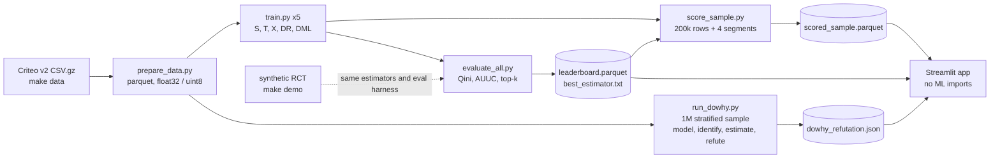

# UpliftBench

> **Who should get the ad?** UpliftBench benchmarks five causal uplift estimators (S, T, X, DR, Double ML) on the 13.9M-row Criteo Uplift v2 randomized experiment, scores them with Qini and AUUC, stress-tests the effect with DoWhy refuters, and turns predicted uplift into a four-way targeting policy with a Streamlit budget explorer. CPU only, one 16 GB laptop.

[](https://github.com/TirtheshJani/UpliftBench/actions/workflows/ci.yml)
[](https://www.python.org/downloads/)
[](https://github.com/astral-sh/uv)
[](LICENSE)
[](https://github.com/astral-sh/ruff)

**In 30 seconds**

- **What**: a reproducible causal-inference benchmark. Response models predict who will convert; uplift models predict who will convert *because* of the treatment. That difference decides where a marketing budget goes.
- **Why it matters**: there is no per-row ground truth for a treatment effect, so the whole job is honest evaluation (Qini, AUUC), refutation (DoWhy), and translating estimates into a decision (persuadables vs sure-things vs lost-causes vs do-not-disturb).
- **Try it without downloading anything**: `uv sync --extra dev && make demo` fits all five estimators on a synthetic RCT with a known effect and prints a Qini/AUUC leaderboard in under a minute.

## Table of contents

1. [What this project is](#what-this-project-is)
2. [Quickstart](#quickstart)
3. [Pipeline](#pipeline)
4. [Results](#results)
5. [Streamlit app](#streamlit-app)
6. [The five estimators](#the-five-estimators)
7. [Evaluation](#evaluation)
8. [The four-way segmentation](#the-four-way-segmentation)
9. [DoWhy refutation](#dowhy-refutation)
10. [What I learned](#what-i-learned)
11. [Hardware and memory budget](#hardware-and-memory-budget)
12. [Reproducibility](#reproducibility)
13. [Limitations](#limitations)
14. [Repo layout](#repo-layout)
15. [Documentation](#documentation)
16. [Repo conventions](#repo-conventions)
17. [Citation](#citation)
18. [License and author](#license-and-author)

## What this project is

UpliftBench takes the public **Criteo Uplift Prediction Dataset v2** (~13.9M rows from an RCT-style randomized ad-targeting experiment) and runs five canonical uplift estimators end-to-end on a single 16 GB laptop:

- **S-learner** (one model, treatment as feature)
- **T-learner** (two models, one per arm)
- **X-learner** (Kunzel et al., 2019; implemented from scratch with LightGBM)
- **DR-learner** (EconML, doubly robust, 3-fold cross-fit)
- **Double Machine Learning** (EconML LinearDML)

Each estimator implements the same `BaseUpliftEstimator` protocol so the evaluation harness, the scoring script, the demo, and the Kaggle notebook all consume them identically. Separately, DoWhy's four-step pipeline (model, identify, estimate, refute) estimates the average treatment effect with its own backdoor linear-regression estimator and stress-tests it with all four standard refuters on a 1M-row sample stratified by treatment.

Three artifacts come out: an interactive Streamlit app where a treatment-budget slider re-allocates targeting across persuadable, sure-thing, lost-cause, and do-not-disturb segments, a self-contained Kaggle notebook that runs the comparison on a 2M-row subsample, and a short technical write-up in [`blog/post.md`](blog/post.md).

## Quickstart

### 1. Install

Requires Python 3.11+ and [uv](https://github.com/astral-sh/uv) (`pip install uv` if you do not have it).

```bash
git clone https://github.com/TirtheshJani/UpliftBench.git
cd UpliftBench
uv sync --extra dev                     # core + dev (tests, lint, types)
```

### 2. No-download demo (under a minute on CPU)

```bash
make demo        # or: uv run python -m upliftbench.demo [--n 50000] [--estimators s-learner,x-learner]
```

`src/upliftbench/demo.py` generates a seeded synthetic RCT shaped like Criteo (12 float32 features, binary treatment and outcome) whose true per-row effect `tau(x) = 0.05 + 0.10 * tanh(f0)` is known and negative for part of the population. It fits the registered estimators on 80% of the rows and scores the held-out 20% with the same `evaluate_estimator` harness used on the real data. One run (seed 42, 20k rows) printed:

```text
         estimator  qini_coef    auuc  top_10_uplift  fit_seconds
oracle (true CATE)     1.0082  1.0146         0.1353       0.0000
               dml     0.9831  0.9856         0.1412       1.7574
         s-learner     0.5283  0.5300         0.1211       0.3761
         x-learner     0.3615  0.3621         0.1244       0.6792
         t-learner     0.1885  0.1878         0.0449       0.3004
        dr-learner     0.1391  0.1325         0.0641       2.3596
            random    -0.1385 -0.1313        -0.0023       0.0000
```

How to read it: the oracle ranks by the true effect (the expected ceiling) and the random row shows the noise floor at this test size. These are **synthetic numbers, not Criteo results**. The synthetic effect is close to linear in one feature, which favors LinearDML, so the ranking says nothing general about the estimators. EconML cross-fitting is unseeded, so the DR and DML rows (and all `fit_seconds`) vary between runs.

### 3. Full Criteo pipeline

```bash
make data       # download criteo-uplift-v2.1.csv.gz (~700 MB, with HF mirror fallback)
make prepare    # CSV.gz to parquet, dtype-optimized, batched
make train-all  # S, T, X, DR, DML on the train split
make eval       # artifacts/leaderboard.parquet + artifacts/best_estimator.txt
make dowhy      # 4-step pipeline + 4 refuters on a 1M stratified sample
make score      # artifacts/scored_sample.parquet (200k held-out rows, all estimators)
make app        # Streamlit budget explorer over the scored sample
```

`scripts/train.py --sample N` trains on a subsample if you want a faster first pass.

### 4. Checks

```bash
make test       # pytest -q
make ci         # lint + fmt-check + type + test-cov + em-dash-check (mirrors GitHub Actions)
make precommit  # pre-commit run --all-files
```

If you only have 60 seconds and just want to read the math, open
[`docs/EVALUATION.md`](docs/EVALUATION.md) and
[`src/upliftbench/eval/qini.py`](src/upliftbench/eval/qini.py).

## Pipeline

The library under `src/upliftbench/` is the **single source of truth**. The scripts, the demo, the Kaggle notebook, and the Streamlit app all import the same modules, so the scoring math is identical across them.



See [`docs/ARCHITECTURE.md`](docs/ARCHITECTURE.md) for module responsibilities.

## Results

**No full-data Criteo leaderboard is committed to this repo, so this README quotes no Criteo Qini, AUUC, or ATE numbers.** The three result artifacts (`artifacts/leaderboard.parquet`, `artifacts/scored_sample.parquet`, `artifacts/dowhy_refutation.json`) are declared in `.gitattributes` for Git LFS but are produced locally by `make eval` / `make score` / `make dowhy` and have not been published. What the repo does contain:

| Evidence | Source | Reproduce with |
|---|---|---|
| Synthetic leaderboard with oracle and random reference rows (above) | `src/upliftbench/demo.py` | `make demo` |
| Qini and AUUC sanity: a perfect ranker scores > 0.05 and the mean over random rankings stays within ±0.03 of 0 on a synthetic fixture | `tests/eval/test_qini.py`, `tests/eval/test_auuc.py` | `make test` |
| Every estimator reaches a positive Qini on synthetic data with a known signal | `tests/estimators/` | `make test` |
| Qualitative full-data observations from the author's own run (DR-learner was the strongest estimator; the full data fit in memory) | [`blog/post.md`](blog/post.md) | Full pipeline above; not independently verified in this repo |

## Streamlit app

```bash
uv sync --extra dev --extra streamlit
make app        # uv run streamlit run streamlit_app/app.py
```

The app does no inference. It reads `artifacts/scored_sample.parquet` (plus the leaderboard and refutation JSON when present), lets you pick an estimator and a treatment budget, and shows how the targeted population splits across the four segments. On a fresh clone the artifacts do not exist yet, so the app shows a message telling you to run `make data && make prepare && make train-all && make eval && make score` first. No hosted deployment is linked from this repo.

## The five estimators

All five implement the same protocol:

```python
class BaseUpliftEstimator(Protocol):
    name: str
    def fit(self, X, T, Y) -> None: ...
    def predict_cate(self, X) -> np.ndarray: ...
    def predict_baseline(self, X) -> np.ndarray: ...
```

They register themselves into `ESTIMATOR_REGISTRY`, which the train CLI and the demo dispatch against. See [`docs/ESTIMATORS.md`](docs/ESTIMATORS.md) for theory and implementation notes per estimator.

## Evaluation

Qini and AUUC are implemented from scratch in `src/upliftbench/eval/{qini,auuc}.py` and TDD'd against synthetic uplift data where the true per-row treatment effect is known analytically. A perfect ranker (sort by ground truth) gives a Qini coefficient > 0.05 on the synthetic fixture; the mean over random rankers stays within ±0.03 of zero. The area integral is a small numpy-version-agnostic trapezoid helper, so the metrics work on numpy 1.x and 2.x.

See [`docs/EVALUATION.md`](docs/EVALUATION.md) for the math.

## The four-way segmentation

The shared `segmentation.score_and_segment` function labels each row as one of:

| Segment | predicted CATE | predicted baseline | meaning |
|---|---|---|---|
| persuadable | > 0 | low | treatment converts them |
| sure_thing | ≤ 0 | high | converts anyway |
| lost_cause | ≤ 0 | low | treatment will not help |
| do_not_disturb | > 0 | high | classical uplift literature flags as negative ROI |

Thresholds live in `src/upliftbench/config.py` (`CATE_THRESHOLD = 0.0`, `BASELINE_THRESHOLD = 0.5`). The Streamlit slider re-allocates the treatment budget across these four buckets live.

## DoWhy refutation

`run_dowhy` wraps the data in DoWhy's four-step pipeline:

1. **Model** the causal graph (treatment, outcome, the 12 features as common causes).
2. **Identify** a backdoor-adjusted estimand.
3. **Estimate** the average effect with DoWhy's own estimator (`backdoor.linear_regression` by default, set via `estimator_method`). The trained meta-learners are evaluated separately by Qini/AUUC; they are not passed into DoWhy.
4. **Refute** with all four standard refuters: `placebo_treatment_refuter`, `random_common_cause`, `data_subset_refuter`, `add_unobserved_common_cause`.

Refutation runs on a **1M-row stratified-by-treatment subsample** (the full 13.9M is intractable on a 16 GB laptop). The sample-size choice is documented in code (`run_dowhy(sample_n=1_000_000)`) and in [`docs/REFUTATION.md`](docs/REFUTATION.md).

## What I learned

### Causal inference is structurally different from prediction

A response model predicts `P(Y=1 | X)`. An uplift model predicts `P(Y=1 | X, T=1) - P(Y=1 | X, T=0)`. The catch: you never observe both for the same row. There is no ground-truth column to validate against per-row, only population-level metrics (Qini, AUUC) that integrate over a ranking. This reframes how you think about validation: instead of "did my predictions match the labels?", the question becomes "does my ranking produce a steeper-than-random cumulative-lift curve when we look at the held-out treated and control arms?".

### Qini math is short but the normalization choice matters

`Q(k) = Y_t(k) - Y_c(k) * (N_t(k) / N_c(k))` is two cumulative sums and a rescaling. The whole curve fits in about 15 lines of numpy. What is **not** short is picking the right denominator for the coefficient. My first implementation divided by `area_optimal - area_random`, where I approximated the optimal curve by sorting on `y*t - y*(1-t)`. That gave a Qini coefficient of -0.25 for a perfect ranker on synthetic data with known positive uplift. The "optimal" curve was actually a near-degenerate shape because of how the placeholder score behaved on early prefixes. Switching to the simpler `2 * (area_model - area_random) / |Q_total|` normalization (random near zero, perfect near one) made the math correct and the tests green. Lesson: TDD against synthetic data with known signal will save you from publishing a benchmark with a sign-flip bug.

### The X-learner's propensity-weighting trick is the interesting part

The X-learner is not "two models" or "four models". The structural insight is: build pseudo-outcomes `D_1 = Y - mu_0(X)` on treated rows and `D_0 = mu_1(X) - Y` on control rows (using the **opposite-arm** response model for each), regress them separately, and then combine the two CATE estimates with the propensity as the weight. The propensity weight is what makes it robust to imbalanced arms: when there are few treated rows, `D_1` is noisy, so `1-g` is small, so `tau_1` gets less weight in the final combination. Under an RCT, `g` is approximately constant; under observational data you would fit a propensity model. That single design choice is the difference between T-learner and X-learner.

### Doubly robust is a strong promise

The DR-learner is doubly robust: consistency of the CATE estimate requires only ONE of (propensity model, outcome regression) to be correctly specified, not both. EconML's implementation does this with 3-fold cross-fitting so the nuisance estimates are out-of-fold when they feed the final stage, avoiding the "training residuals are biased toward zero" trap. Cross-fitting is a small implementation cost (you fit nuisances K times) but the bias guarantee is large. This is also why Double Machine Learning works: residualize both sides, then regress residual on residual.

### DoWhy refutation is the part that separates a benchmark from a press release

The four refuters answer different questions:
- `placebo_treatment`: if you scramble the treatment column, does the estimate go to zero? (sanity)
- `random_common_cause`: if you add a meaningless covariate, does the estimate stay put? (robustness to spurious adjustment)
- `data_subset`: is the estimate stable to row subsampling? (no concentration in a few rows)
- `add_unobserved_common_cause`: how strong would a hidden confounder need to be to drive the estimate to zero? (sensitivity)

An ATE point estimate without these refutations is a number, not a finding. The 1M-row sample size for refutation is a pragmatic compromise; the math would be more precise on the full data, but the laptop wall-time is the binding constraint, not the statistical precision.

### Memory engineering is half the work on a single laptop

13.9M rows fits in 16 GB only if you treat dtype as a first-class design decision. Float32 features, uint8 treatment / visit / conversion, parquet with zstd, pyarrow batch iteration at 500k rows, and `lgb.Dataset(free_raw_data=True, max_bin=63)` keep peak RSS under 6 GB during training. Skip any one of those and you can blow past 12 GB and start swapping. The first time I tried with default pandas dtypes, the to_pandas() call alone took 4 GB just for the feature matrix.

### The segmentation step is where the model meets the budget decision

A CATE estimate alone is not actionable. To decide who to treat, you need both the predicted uplift AND the predicted baseline outcome: someone with high baseline propensity is going to convert anyway, so spending budget on them is waste even if their CATE looks high. The four-way segmentation (persuadables, sure-things, lost-causes, do-not-disturb) is the canonical way to translate `(pred_cate, pred_baseline)` into a targeting policy. The Streamlit slider makes this tangible: at small budgets you're targeting almost pure persuadables, but as the budget grows the marginal added user is increasingly a sure-thing or a do-not-disturb. That diminishing-returns curve is the story.

### The "no inference at runtime" Streamlit pattern

Streamlit Community Cloud caps each app at ~1 GB RAM. LightGBM + DoWhy + CausalML + EconML alone come to several hundred MB of installed code, and loading even one trained model adds more. The right pattern is to precompute a 200k-row scored sample at training time, persist it as a parquet via Git LFS, and have the Streamlit app do only filtering and segmentation math at runtime. The app's import list is intentionally `pandas, matplotlib, streamlit` plus two upliftbench modules: `config` (pure constants) and the shared `segmentation` module. No heavy ML imports anywhere. Cold start drops from "model loading times out" to under three seconds.

### Library version pinning is not optional in causal inference

DoWhy 0.12 still uses `networkx.algorithms.d_separated`, which networkx removed in 3.3. CausalML's X-learner internally uses pygam, which calls `.A` on a scipy sparse matrix, which scipy removed in a recent release. Both broke before I had any code on the page. The fix is networkx pinned `<3.3` in pyproject and a from-scratch X-learner implementation that skips the pygam path. Both decisions are documented in the code so a future reader knows which pins are accidental and which are load-bearing.

### TDD is unreasonably effective on math-bearing code

Most of the test files are TDD against synthetic data with a known signal: per-row uplift `u_i = sigmoid(x_i)`, then verify a perfect ranker beats random by a measurable margin and a random ranker stays within ±0.03 of zero. Those tests caught the Qini sign-flip described above, caught a propensity-weighting direction bug in the X-learner, and caught a dtype regression in the parquet writer. Each test ran red first, then green after the minimal implementation. The cycle felt slow on the first task; by the fifth it was the fastest way to ship the math.

## Hardware and memory budget

| Item | Value |
|---|---|
| Target hardware | RTX 4080 laptop, 16 GB system RAM, Windows or WSL2 |
| GPU | Not used. CPU-only, by design. |
| Python | 3.11+ |
| Env manager | uv + pyproject.toml + src/ layout |
| Lint/type | ruff + mypy |
| Tests | pytest, TDD for math-bearing modules, smoke tests for estimators |
| CI | GitHub Actions, ubuntu-latest only |

Memory tactics:

- float32 features, uint8 treatment/visit/conversion.
- pyarrow batch iteration with `batch_size=500_000`.
- `lgb.Dataset(..., free_raw_data=True, max_bin=63)`.
- Documented fallback to a 5M-row stratified-by-treatment sample if peak RSS ever exceeds 12 GB.

## Reproducibility

- All splits derive from a single seed (`SEED=42` in `src/upliftbench/config.py`).
- The held-out test-row hash is recorded in each model's metadata JSON; every estimator on the leaderboard was scored on the same rows.
- Library versions are persisted in metadata at training time.
- `uv.lock` pins the full dependency set.
- CI runs `ruff check`, `ruff format --check`, `mypy src`, `pytest --cov`, and an em-dash grep check on every push; `make ci` runs the same steps locally.

## Limitations

- **No published full-data results.** See [Results](#results). Until the artifacts are committed via LFS, every Criteo number has to be regenerated locally (download ~700 MB, then several CPU hours).
- **Not run end-to-end in CI.** CI covers unit tests, estimator smoke tests on synthetic data, and the DoWhy pipeline on a small synthetic frame. `make data` through `make score` were not executed in CI or in the [Phase 6 audit](docs/PHASE6_REPRO_AUDIT.md). Timing and memory figures in this README and the blog come from the author's runs.
- **DoWhy refutes a linear backdoor ATE, not the best meta-learner's CATE.** That is a deliberate scope choice, but it means the refuters say nothing directly about the heterogeneous estimates used for targeting.
- **Not fully deterministic.** LightGBM uses its own default seeds and EconML cross-fitting is unseeded, so DR and DML numbers move slightly between runs.
- **The `streamlit` extra is not standalone.** The heavy ML libraries are core dependencies in `pyproject.toml`, so installing the package with `[streamlit]` still pulls them in. A Streamlit Community Cloud deployment would need its own slim requirements file.
- **Single dataset, single outcome.** Training and refutation target `visit`; `conversion` is kept in the parquet but not modeled.

## Repo layout

```
UpliftBench/
├── README.md, LICENSE, CITATION.cff, CLAUDE.md, Makefile
├── pyproject.toml, uv.lock                # uv-managed env (Python 3.11+)
├── .pre-commit-config.yaml                # ruff format + check, em-dash forbidder
├── .github/workflows/ci.yml               # GitHub Actions, ubuntu-latest only
├── .streamlit/config.toml                 # theme + headless settings
├── .claude/skills/                        # five bundled skills (auto-loaded by Claude Code)
├── .gitattributes                         # Git LFS rules for three artifacts
├── docs/                                  # architecture, data, estimators, eval, refutation, contributing, audit
├── src/upliftbench/
│   ├── config.py                          # paths, FEATURES, LIGHTGBM_PARAMS, thresholds
│   ├── features.py                        # Criteo schema (pyarrow), dtype map
│   ├── demo.py                            # no-download synthetic RCT demo (make demo)
│   ├── data/
│   │   ├── prepare.py                     # streaming CSV.gz to parquet (pyarrow)
│   │   └── loader.py                      # chunked iterator + train_test_split_rct
│   ├── estimators/
│   │   ├── base.py                        # BaseUpliftEstimator Protocol
│   │   ├── s_learner.py, t_learner.py     # LightGBM
│   │   ├── x_learner.py                   # LightGBM from scratch (no causalml dep)
│   │   ├── dr_learner.py, dml.py          # EconML wrappers
│   │   └── __init__.py                    # ESTIMATOR_REGISTRY + get_estimator
│   ├── eval/
│   │   ├── qini.py, auuc.py, topk.py
│   │   └── harness.py                     # evaluate_estimator() entry point
│   ├── refute/dowhy_pipeline.py           # 4 steps + all 4 standard refuters
│   ├── segmentation.py                    # SHARED API (no heavy deps)
│   ├── persistence.py                     # save/load + sibling JSON metadata
│   └── plotting.py
├── scripts/                               # Typer CLIs
│   ├── download_data.py                   # primary URL + HF mirror fallback
│   ├── prepare_data.py
│   ├── train.py, evaluate_all.py
│   └── run_dowhy.py, score_sample.py
├── notebooks/                             # EDA, per-phase notebooks, comparison, Kaggle end-to-end
├── streamlit_app/app.py                   # no heavy ML imports
├── tests/                                 # pytest tree mirrors src/
├── artifacts/                             # produced locally by make eval/score/dowhy; not committed
└── blog/post.md
```

## Documentation

| Doc | What it covers |
|---|---|
| [`docs/ARCHITECTURE.md`](docs/ARCHITECTURE.md) | Module map, dependency graph, shared-API contracts |
| [`docs/DATA.md`](docs/DATA.md) | Criteo Uplift v2 schema, download path, memory tactics |
| [`docs/ESTIMATORS.md`](docs/ESTIMATORS.md) | Theory + implementation notes for each of the five learners |
| [`docs/EVALUATION.md`](docs/EVALUATION.md) | Qini and AUUC math, normalization, anti-patterns |
| [`docs/REFUTATION.md`](docs/REFUTATION.md) | DoWhy 4-step pipeline, each refuter's intent |
| [`docs/CONTRIBUTING.md`](docs/CONTRIBUTING.md) | Dev setup, TDD policy, pre-commit, CI |
| [`docs/PHASE6_REPRO_AUDIT.md`](docs/PHASE6_REPRO_AUDIT.md) | Reproducibility audit and what it did not verify |
| [`blog/post.md`](blog/post.md) | Short technical write-up |

Contributions are welcome; start with [`docs/CONTRIBUTING.md`](docs/CONTRIBUTING.md).

## Repo conventions

- **No em dashes** anywhere in committed text. A pre-commit hook and a CI grep enforce this. Use commas, parentheses, or semicolons.
- **No `git add -A`**. Stage specific paths so secrets and large files cannot slip in.
- **Git LFS** rules in `.gitattributes` are scoped to `artifacts/{scored_sample.parquet, leaderboard.parquet, dowhy_refutation.json}`. These files do NOT ship with the repo; they are produced locally by `make score` / `make eval` / `make dowhy` and only committed via LFS if you choose to publish them. Trained models are gitignored; reproduce with `make train-all`.
- **Branch policy**: develop on a feature branch (e.g. `claude/<topic>`) and open a PR to `main`. Do not push to `main` without explicit user request.
- **Bundled skills**: `.claude/skills/` ships five Claude Code skills (`writing-plans`, `executing-plans`, `test-driven-development`, `dispatching-parallel-agents`, `karpathy-guidelines`) that any Claude Code session in this repo auto-loads.

## Citation

To cite this repository, use the metadata in [`CITATION.cff`](CITATION.cff) (GitHub shows a "Cite this repository" button for it).

If you use the data, please cite the Criteo dataset:

```bibtex
@inproceedings{Diemert2018,
  author    = {Diemert, Eustache and Betlei, Artem and Renaudin, Christophe and Amini, Massih-Reza},
  title     = {A Large Scale Benchmark for Uplift Modeling},
  booktitle = {Proceedings of the AdKDD and TargetAd Workshop, KDD},
  year      = {2018}
}
```

## License and author

MIT (see [`LICENSE`](LICENSE)). Built by **Tirthesh Jani** ([@TirtheshJani](https://github.com/TirtheshJani)).

The Criteo Uplift Prediction Dataset v2 is provided by Criteo AI Lab under their dataset license; this repo does not redistribute the data, only fetches it on demand.
